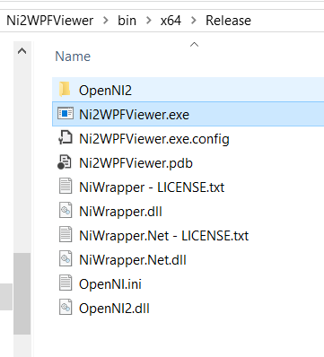
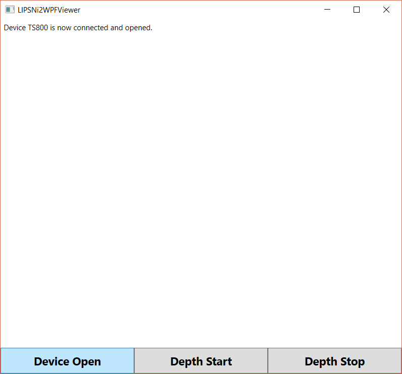
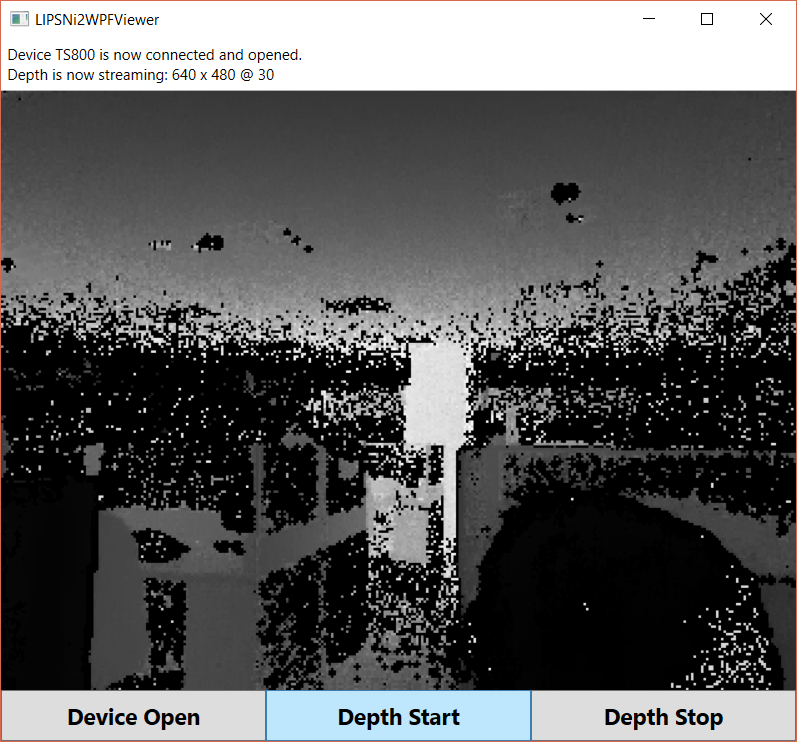

# Ni2WPFViewer #
In this sample, you can integrate [OpenNI 2 and NiTE 2 .Net Wrapper](https://github.com/falahati/NiWrapper.Net) into your
WPF project to capture depth image from LIPSedge DL/M3 ToF cameras.

### Requirements ###
1. Visual Studio 2017
2. Download and install **LIPS SDK for Windows and OpenNI2** from our [website](https://www.lips-hci.com/downloads/category)
3. [NiWrapper v2.2.0.33 stable release](https://github.com/falahati/NiWrapper.Net/releases/tag/v2.2.0.33-v2.2.0.11) (included in this sample)

### Build Ni2WPFViewer ###
* Use Visual Studio 2017 to open project *Ni2WPFViewer.sln*
* Select the target Ni2WPFViewer and build solution for Release x64

* You can find executable **Ni2WPFViewer.exe** in the folder *Ni2WPFViewer\bin\x64\Release*

* Connect LIPSedge ToF camera and double click **Ni2WPFViewer.exe** to run it

* Click button "Device Open" to connect camera
  - Please wait output message shows "Device TSxxx is now connected and opened."

* Click button "Depth Start" to start streaming

* Click button "Depth Stop" to stop streaming

